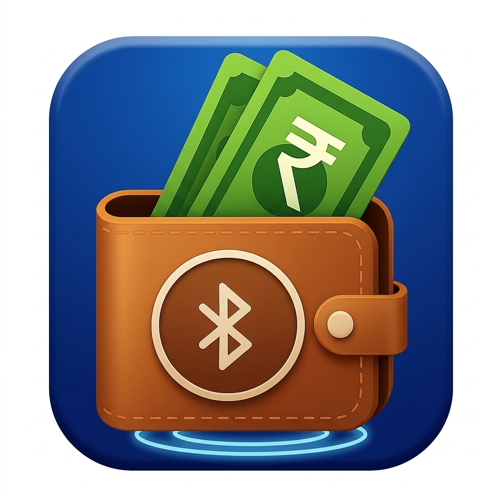

# ⚡ OffPay (OFF-PAY)

<div align="center">

  

  ### **Zero Internet. Maximum Security. Instant Offline Bluetooth Payments.**

  [](https://flutter.dev)
  [](https://dart.dev)
  [](https://developer.android.com/guide/topics/connectivity/bluetooth/ble)
  [](LICENSE)

  <p align="center">
    <b>OffPay</b> is a next-generation peer-to-peer (P2P) offline digital wallet app built with Flutter. It enables instant financial transactions between nearby devices using Bluetooth Low Energy (BLE) and cryptographic handshakes—<b>completely without cell service, Wi-Fi, or internet access</b>.
  </p>

</div>

---

## 🌟 Key Features

- 📡 **Offline Bluetooth P2P Transfers:** Send and receive payments directly device-to-device without internet or cell towers.
- 🛡️ **2-Way Cryptographic Handshake:** Encrypted payload verification with transaction nonces to prevent double-spending and replay attacks.
- 🔍 **Real-Time BLE Discovery & Radar:** Live peer scanning with signal meters (RSSI dBm), distance proximity estimation, and a radar visualizer.
- 🎯 **Verified OFFPAY Filter:** Smart filter powered by a dedicated 128-bit Service UUID (`0000180A-0000-1000-8000-00805F9B34FB`) that isolates real app users from generic Bluetooth devices.
- 🔕 **Active-Route Context Protection:** Automatically suppresses annoying device pop-ups while typing payment amounts or viewing receipts.
- 📲 **Dynamic & Static QR Payment Engine:** Scan and generate offline QR code payment tokens with built-in camera scanning (`mobile_scanner`).
- 🔒 **PIN & Privacy Security:** Balance hiding with PIN protection, profile customization, and device ID randomization.
- 🔄 **Dual Ledger Sync (Hive + Cloud):** Instant local persistence via Hive DB with silent background reconciliation to Firebase Cloud Ledger upon network recovery.
- 🎨 **AMOLED Dark & Modern Theme:** Visual design with AMOLED black mode, animated pulse indicators, and tactile haptic feedback.

---

## 📐 Architecture & How It Works

```
┌─────────────────┐       BLE Scan & Advertising       ┌─────────────────┐
│   Sender Phone  │ ─────────────────────────────────► │ Receiver Phone  │
│  (OffPay App)   │ ◄───────────────────────────────── │  (OffPay App)   │
└────────┬────────┘      Service UUID Handshake        └────────┬────────┘
         │                                                      │
         ▼                                                      ▼
 1. Encrypt Payload                                     1. Decrypt Payload
 2. Write GATT Characteristic                           2. Verify Nonce/Sig
 3. Commit Hive Ledger                                  3. Credit Hive Wallet
         │                                                      │
         └───────────────────► Cloud Sync ◄─────────────────────┘
                              (When Online)
```

### 🔐 Transaction Lifecycle
1. **Discovery:** Sender scans BLE frequencies for surrounding devices advertising `OFFPAY_SERVICE_UUID`.
2. **Proximity Handshake:** Sender initiates GATT connection to Characteristic `00002A50-0000-1000-8000-00805F9B34FB`.
3. **Cryptographic Payload:** Sender transmits signed packet containing `senderId`, `timestamp`, `amount`, and `nonce`.
4. **Local Settlement:** Receiver's app verifies token validity offline and updates local Hive database atomically.
5. **Background Cloud Sync:** When internet restores, `ServerSyncService` reconciles local transaction logs with Cloud Firebase Ledger.

---

## 📱 App Screenshots & Screens

| Home Dashboard | Peer Discovery | Receive Payment |
| :---: | :---: | :---: |
| Wallet balance, PIN protection & transaction history | Animated radar scanner with RSSI dBm signal meter & filter | BLE advertising beacon & QR code receiver screen |

---

## 🛠️ Technology Stack

- **Framework:** [Flutter](https://flutter.dev) (Dart 3+)
- **State Management:** [Provider](https://pub.dev/packages/provider)
- **Bluetooth Communication:** [Flutter Blue Plus](https://pub.dev/packages/flutter_blue_plus) (`flutter_blue_plus`)
- **Local Persistence:** [Hive](https://pub.dev/packages/hive) & [Hive Flutter](https://pub.dev/packages/hive_flutter)
- **QR Code Scanning & Generation:** [Mobile Scanner](https://pub.dev/packages/mobile_scanner) & [QR Flutter](https://pub.dev/packages/qr_flutter)
- **Permissions:** [Permission Handler](https://pub.dev/packages/permission_handler)
- **Cloud Reconciliation:** Firebase Integration (`firebase_service.dart`)

---

## 📂 Project Structure

```
lib/
├── main.dart                   # Application entry point & theme definitions
├── models/                     # Data models & Hive type adapters
│   ├── transaction_model.dart  # Offline transaction record model
│   ├── transaction_status.dart # Transaction state enums
│   └── wallet_model.dart       # Wallet balance & ledger state manager
├── screens/                    # UI Screens
│   ├── home_screen.dart        # Main dashboard with balance card & transaction history
│   ├── discovery_screen.dart   # Radar discovery & nearby BLE device scanner
│   ├── payment_input_screen.dart # Transfer amount input & transfer execution
│   ├── payment_success_screen.dart # Animated receipt & transaction summary
│   ├── receive_screen.dart     # Receiver BLE beacon & QR payment acceptor
│   ├── send_options_screen.dart# Send money navigation options
│   ├── qr_scanner_screen.dart  # Camera QR code scanner
│   ├── custom_qr_screen.dart   # Custom payment request QR generator
│   ├── profile_screen.dart     # User profile, device ID & avatar settings
│   └── security_settings_screen.dart # PIN settings & security controls
├── services/                   # Core business logic & native handlers
│   ├── bluetooth_service.dart  # BLE scanning, GATT connection & advertising
│   ├── handshake_crypto_service.dart # Encrypted payload generator & signature verifier
│   ├── firebase_service.dart   # Cloud ledger sync engine
│   ├── password_service.dart   # Balance PIN encryption & storage
│   ├── profile_service.dart    # User profile & device configuration
│   └── server_sync_service.dart# Offline queue background sync worker
└── widgets/                    # Reusable UI components
```

---

## 🚀 Getting Started

### Prerequisites

- [Flutter SDK](https://flutter.dev/docs/get-started/install) (`>= 3.0.0`)
- Android Studio / VS Code with Flutter extension
- Physical Android or iOS device *(Physical devices are required for Bluetooth BLE hardware testing)*

### Installation

1. **Clone the repository:**
   ```bash
   git clone https://github.com/your-username/offpay_app.git
   cd offpay_app
   ```

2. **Install dependencies:**
   ```bash
   flutter pub get
   ```

3. **Run build runner (for Hive code generation):**
   ```bash
   flutter pub run build_runner build --delete-conflicting-outputs
   ```

4. **Connect a physical device & run:**
   ```bash
   flutter run
   ```

---

## 🔒 Security & Privacy

- **No Remote Intermediary Needed:** Payments are settled locally device-to-device without centralized server reliance.
- **Double-Spending Prevention:** Nonce tracking and local cryptographic signatures ensure transaction integrity.
- **PIN Authorization:** Sensitive actions (unhiding balance, changing device settings) are protected via local PIN verification.

---

## 📄 License

Distributed under the MIT License. See `LICENSE` for details.

---

<div align="center">
  <sub>Built with ❤️ using Flutter & Bluetooth LE</sub>
</div>
